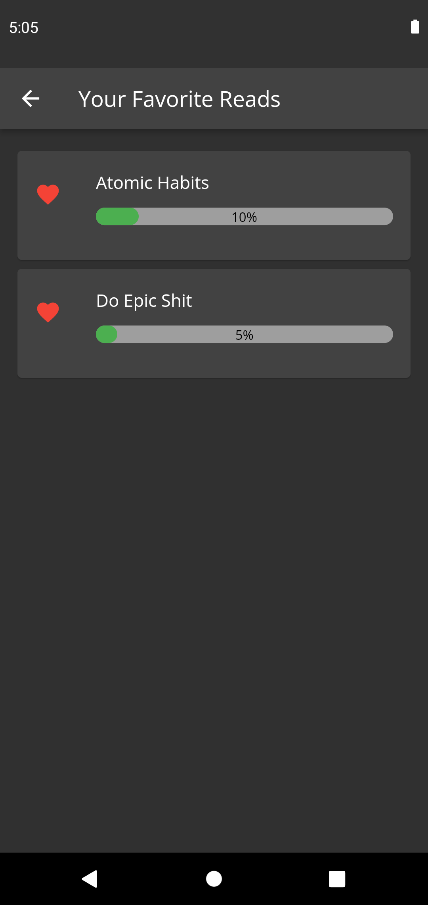

# Reador

## Inspiration

I love to read books but when I cannot keep track of my readings, I end up reading multiple books and could not complete one book completely.

## What it does

This Android application will help you adding your current books that you are going to read and also helps to keep the track of the pages you have read. Basically, it tells us about the percentage of the book read so far. It also has a Dark and Light Theme.

## How we built it

I build this application using Flutter Framework with Provider as the state management in about 5 hours and Hive Database as local storage.

## Challenges we ran into

I ran into many challenges :

1. I was unable to figure out how to swap two indexes in local hive storage.

## Accomplishments that we're proud of

1. I was able to create MVP application that can be released on to the playstore.
2. I coded this application from scratch alone in 5 hours.

## What we learned

1. I learned about Provider.
2. I learned about Reorderable ListView.
3. I learned about Hive Storage.

## What's next for Reador

1. Integrate ReorderableListView with local database and I can then reorder my learnings.
2. Add a feature to start the best reads so that I can read them again and again (This is already done).

## How to setup locally ? 🏁

1. Fork the repository.

2. Clone the repository using the following command.

```
https://github.com/<your-user-name>/Reador.git
```

3. Open the code in your favorite code editor.

4. Install the dependencies using the following command:

```
$ flutter pub get
```

5. Build the app using the following command:

```
$ flutter run
```

## Screenshots

<p align="center">
  
  
  
  
  
  
  
  

## Devpost Link

- https://devpost.com/software/reador
